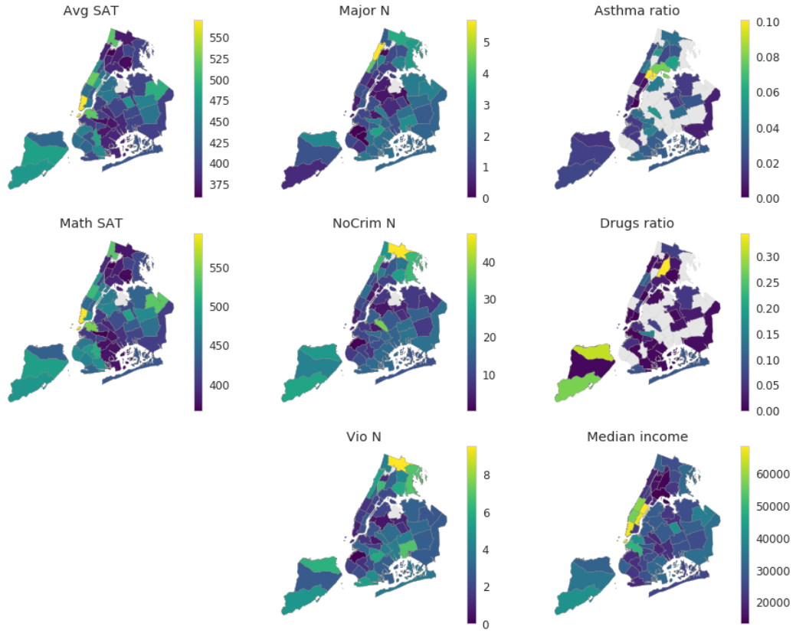

# Final Exam, Principles of Urban Informatics course at NYU CUSP by [Federica Bianco](https://github.com/fedhere)

In [this notebook](https://github.com/pmandiola/pui_final/blob/master/PUI_final_pmb434.ipynb) you can find my answer to the exam, for which we had one weekend to work on.

## Modeling school performance of NYC students as a function of crime, drugs, and living conditions

There is a known connection between school performance and the environment that a child is exposed to, including environmental conditions that may affect health, exposure to violence which affects stress level, and socioeconomic features, including income, which may determine the ability of a student to get help. Nonetheless, the modeling of school performance is difficult, as measures of performance may be biased and environmental features hard to measure.

In this exam, we tried to model performance, measured through school SAT score, of NYC students as a function of exposure to crime, measured through reports of crimes in school, living conditions, measured through the incidence of respiratory and drug related issues in the area, and optionally income.

For the analysis, we first did some exploratory data analysis mapping the independent and dependent variables in NYC and assesed collinearity across variables. We created several linear regression models and random forest regressions to predict the SAT scores with different combinations of features related to crime, drugs, living conditions, and income. 

## Data sources

[NYC Open Data](https://opendata.cityofnewyork.us/):
* 2012 SAT Scores
* 2010-2016 School Crime Data
* PUMA GeoData

[NY State Open Data Health](https://healthdata.ny.gov/):
* Hospital Inpatient Discharges (SPARCS)

[US Census API](https://www.census.gov/developers/):
* Median Income by PUMA from ACS 2012 5-year
